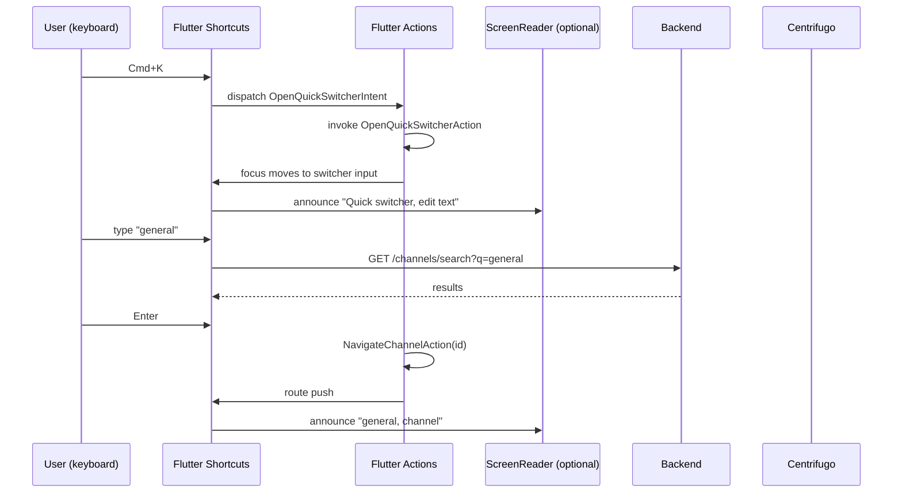

# Full Keyboard Navigation — App Flow

## 1. End-to-End Journey



## 2. State Machine

```
[idle]
   │ keystroke
   ▼
[match-shortcut?]
   │ yes → invoke action
   │ no  → propagate to focused widget
   ▼
[invoking]
   │ done
   ▼
[idle]

[modal-open]
   │ Esc
   ▼
[modal-closing] -- focus returns to originator --> [idle]
```

## 3. User Journeys

### J1 — Happy path: keyboard-only user sends a message
1. Mehmet lands on the home screen; first Tab hits "Skip to content" (announced).
2. He hits Tab again to go to server list.
3. Arrow keys move between servers; Enter activates a server.
4. Tab into channel list; Arrow keys; Enter into a channel.
5. Tab into the message input; types message; Cmd+Enter sends.
6. After send, focus stays in input; live region announces "Message sent".

### J2 — Help overlay
1. User presses `?` from any screen.
2. Help overlay opens with focus on the search field.
3. User types "voice"; the list filters to two entries.
4. User presses Esc; focus returns to where they came from.

### J3 — Modal trap
1. User opens "New server" modal.
2. Tab cycles only between modal fields and primary/secondary buttons.
3. Esc closes modal; focus returns to the "+" button that opened it.

### J4 — Browser-reserved shortcut
1. User presses Ctrl+W in web client.
2. Browser closes the tab; we never override.

### J5 — IME suppression
1. User types in CJK with an IME open.
2. R, E, T do NOT trigger reaction/reply/thread shortcuts; they go to the IME.

## 4. Edge Cases

- **External keyboard plugged in mid-session:** shortcut hints toggle on automatically; existing focus preserved.
- **Mid-typing focus shift:** if user starts typing while a non-input is focused, we beep softly and don't lose state.
- **Switch control input:** acts like a keyboard; works the same.
- **Locale-specific keyboards (AZERTY):** logical keys only; "Q" stays "Q" regardless of layout.
- **Right-to-left:** Arrow keys swap (Left = next, Right = previous in nav).
- **Reduced-motion:** focus ring transitions instant; help overlay fade-only.

## 5. Background / Async

- Telemetry batched via existing analytics worker, every 60s.

## 6. Notifications

- None new.

## 7. Cross-Feature Interactions

- With **screen-reader-full**: shortcuts announce themselves via live region when invoked ("Quick switcher opened").
- With **high-contrast-mode**: focus ring uses `focusOutlineHC` token.
- With **reduced-motion-mode**: focus transitions instant.
- With **color-blind-mode**: focus ring colour stays high contrast (no daltonization applied to focus indicators).

## 8. Telemetry Events

- `keyboard.shortcut.invoke` { intent }
- `keyboard.help_overlay.open` { source: "shortcut" | "settings" }
- `keyboard.skip_to_content.use`
- `keyboard.focus_trap.escape`
- `keyboard.shortcut.collision` { intent, blocked_by_browser: true }
