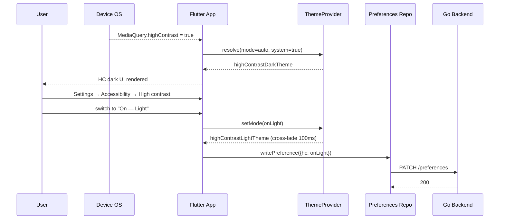

# High Contrast Mode — App Flow

## 1. End-to-End Journey



## 2. State Machine

```
[off]   -- toggle auto -->  [auto]
[off]   -- pick light -->   [on_light]
[off]   -- pick dark -->    [on_dark]
[auto]  -- system off -->   [resolved_default]
[auto]  -- system on  -->   [resolved_hc_<scheme>]
[on_*]  -- toggle off -->   [off]
```

`resolved_*` are computed states; the persisted state is one of `{off, auto, on_light, on_dark}`.

## 3. User Journeys

### J1 — Happy path: low-vision user opts in via auto
1. Renee enables "Increase contrast" on iOS.
2. Opens Flicko; onboarding step #4 shows the auto suggestion.
3. Taps "Use HC theme".
4. App cross-fades to high-contrast dark.
5. Preference `auto` saved server-side.
6. Next time she launches Flicko on a new device, preference syncs and HC continues.

### J2 — Server admin keeps custom accent on
1. Admin Avi has set server accent to `#FF66CC` (3.4:1 vs surface).
2. Renee joins the server with HC mode on.
3. Default behavior: app neutralises Avi's accent to `focusOutlineHC`.
4. Renee, after testing, decides she actually likes the magenta and toggles "Replace custom accents" off.
5. App restores the magenta accent for that visit; warning banner notes the contrast is below AAA.

### J3 — User turns HC off mid-session
1. User toggles "Off" in Settings.
2. App cross-fades back to default theme.
3. PATCH /preferences saves the change.
4. Live region announces "High contrast off" (if screen reader is on).

### J4 — System pref changes mid-session
1. iOS user toggles system "Increase Contrast" while Flicko is open.
2. `MediaQuery` change rebuilds the theme without restart.
3. Preview card on settings screen also rebuilds.

## 4. Edge Cases

- **Offline:** preference write queued; resolved state still computed locally.
- **Conflicting pref between devices:** last-write-wins via `updated_at` on `accessibility_json`.
- **Server accent denylist:** very dark accents (luma < 0.2) are kept regardless because they're already high contrast.
- **Custom emoji backgrounds:** decorative; not tinted by HC.
- **Rich embeds with custom palettes:** not modified (out of scope, documented limitation).
- **Image content (uploaded photos):** never modified.
- **Reduced motion + HC:** 0 ms theme switch instead of cross-fade.

## 5. Background / Async

- No backend cron; all logic client-side.
- The override loader from `screen-reader-full` (announcement strings) is independent.

## 6. Notifications

- None new. Existing in-app banners and snackbars adopt HC tokens automatically.

## 7. Cross-Feature Interactions

- With **screen-reader-full**: HC tokens are announced on focus only when the user enables the verbose option.
- With **reduced-motion-mode**: theme cross-fade collapses to instant.
- With **color-blind-mode**: combined "high contrast + protanopia" preset available; CB filter applies on top of HC palette (matrix multiply).
- With **dyslexia-font**: font choice independent of palette; HC + OpenDyslexic supported.
- With **server-accent customization**: HC neutralises by default; opt-out per-user.

## 8. Telemetry Events

- `accessibility.hc_mode.set` { mode, source: "manual"|"system"|"onboarding" }
- `accessibility.hc_mode.preview_swapped`
- `accessibility.hc_mode.accent_neutralised` { server_id, original_color }
