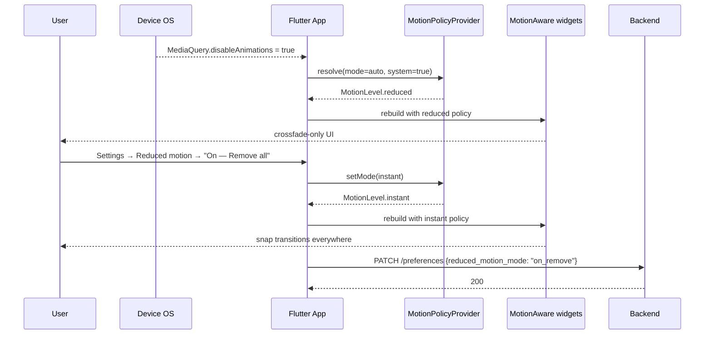

# Reduced Motion Mode — App Flow

## 1. End-to-End Journey



## 2. State Machine

```
[off]   -- pick auto -->        [auto]
[off]   -- pick reduce -->      [on_reduce]
[off]   -- pick remove -->      [on_remove]
[auto]  -- system off -->       [resolved_full]
[auto]  -- system on  -->       [resolved_reduced]
```

## 3. User Journeys

### J1 — Happy path: vestibular user opts in via system pref
1. Priya has "Reduce Motion" on at iOS level.
2. Opens Flicko; first-launch nudge shows.
3. Taps "Yes, less motion".
4. Animations switch to crossfade. GIF auto-pause turned on.
5. Preference saved; syncs across devices.

### J2 — User finds reduced still too much, switches to instant
1. After 1 day of "reduced", Priya gets a snackbar that fades in and decides even that is uncomfortable.
2. Goes to Settings → Reduced motion → "On — Remove all motion".
3. All transitions become instant.

### J3 — Designer wants to test full motion temporarily
1. Designer toggles to "Off" to dogfood.
2. App restores all default animations.
3. Toggle persists per-device until changed.

### J4 — System pref changes mid-session
1. User toggles iOS Reduce Motion off.
2. `MediaQuery` change triggers `MotionPolicyProvider` rebuild.
3. App returns to full motion smoothly.

### J5 — GIF auto-pause respected
1. Channel has 12 animated stickers.
2. With auto-pause on, Flicko renders the first frame of each.
3. User taps a sticker → it animates once (one-shot) → returns to first frame.

## 4. Edge Cases

- **Lottie file with infinite loop:** in reduced mode, render frame 0 only.
- **Hero animations across pages:** in reduced mode, no flight; both pages crossfade.
- **Pull-to-refresh spinner:** in reduced mode, replace with static "Loading…" text.
- **Notification banner slide-in:** in reduced, fade-in only.
- **Long-press preview popup:** in reduced, instant appear with 80% scrim.
- **Reduced + RTL:** unchanged; motion modulation is direction-agnostic.

## 5. Background / Async

- None.

## 6. Notifications

- None new.

## 7. Cross-Feature Interactions

- With **screen-reader-full**: announcements unaffected; only motion is suppressed.
- With **high-contrast-mode**: theme cross-fade duration follows reduced-motion.
- With **dyslexia-font**: preview cross-fade follows reduced-motion.
- With **full-keyboard-nav**: focus ring transitions follow reduced-motion (instant in `instant` mode).
- With **captions-voice-video**: caption auto-scroll uses crossfade in reduced.

## 8. Telemetry Events

- `accessibility.motion.set` { mode, source: "manual"|"system"|"onboarding" }
- `accessibility.motion.gif_autopause` { enabled }
- `accessibility.motion.preview_played`
