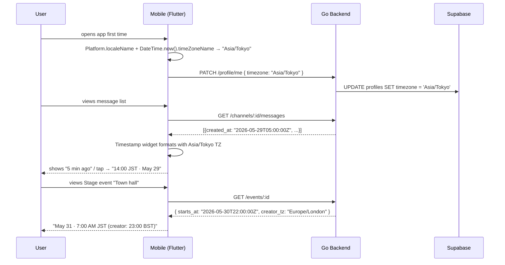

# Local Timezones — App Flow

## 1. End-to-End Journey



## 2. State Machine — TZ resolution

```
[boot]
  → [profile.timezone present?] → use it
  → [device tz available?]      → use device, persist to profile
  → [fallback]                  → UTC (with banner offering picker)
[user changes tz in settings] → patch profile + reload all timestamps
[user travels & device tz changes] → silent compare, prompt: "Update to local TZ?"
```

## 3. User Journeys

### J1 — First-time user (happy path)
1. App detects `Asia/Tokyo` from device.
2. Profile updates silently.
3. Every screen renders in JST.

### J2 — Manual override
1. DevOps user wants UTC everywhere.
2. Settings → Language & Region → Timezone → "UTC".
3. Persisted; toast "Timezone set to UTC".
4. All timestamps recalc on next render.

### J3 — Traveler
1. User flies from NYC (`America/New_York`) to Berlin (`Europe/Berlin`).
2. App detects new device TZ on next launch.
3. Soft prompt: "You appear to be in Berlin. Show times in Europe/Berlin?" with [Yes / Keep NYC / Always ask].
4. User picks "Yes"; profile updated.

### J4 — Scheduled event cross-zone
1. Creator in London schedules Town Hall for "May 30, 23:00 BST".
2. UTC stored: `2026-05-30T22:00:00Z`.
3. Viewer in Tokyo sees: "May 31 · 7:00 AM JST" with tooltip "Creator's time: 23:00 BST".
4. Viewer adds to calendar; .ics export uses `TZID=Asia/Tokyo`.

### J5 — Looking back at a message
1. Hiroshi opens a chat with messages from yesterday.
2. Each message: relative "12 hours ago".
3. He long-presses → bottom sheet "May 28 · 19:43 JST · 10:43 UTC".

### J6 — Pseudo-zone QA
1. Developer toggles dev menu → "Force UTC-13 (TKL)".
2. Every timestamp recalculates; surfaces edge case where some screen still hardcoded `DateFormat.Hm()` instead of using `Timestamp` widget.

## 4. Edge Cases

- **DST transitions:** "spring forward" 2:30am does not exist; we display the next valid clock time and tag with `*` if asked. "Fall back" 1:30am exists twice; we always show the *first* occurrence (DST=true) for clarity.
- **Half-hour zones (IST, NPT, etc.):** `intl` handles `+05:30` correctly; verify `format` outputs match user expectation.
- **Users with TZ disabled (rare):** fall back to UTC silently; prompt picker.
- **Negative offsets (-12 to +14):** clip to valid IANA zones.
- **Future events crossing DST boundary:** stored as UTC instant; display follows current rules at that future date (correct because IANA db has DST schedules baked in).
- **Server outage at midnight:** stored times are UTC; relative times keep ticking on client.
- **Editing a past event time:** changes UTC; all viewers see the new time on refresh.
- **Audit logs:** always include both UTC and viewer-TZ columns to avoid forensic ambiguity.

## 5. Background / Async

- No background work specific to this feature.
- One-time data backfill: `profile.timezone IS NULL` rows get a stub `UTC` until next user login.

## 6. Notifications

- Push: title/body include time in recipient's TZ — built server-side using `recipient.timezone`.
- Email: receipts and notifications use `user.timezone` for date formatting.
- In-app banners: time formatted using `Timestamp` widget already.

## 7. Settings UI Flow

```
[Settings] → [Language & Region] → [Timezone]
   → Search picker with cities + offsets
   → Suggested: device-detected, UTC, profile.region default
   → All zones: alphabetical with "(UTC+9:00)" suffix
   → "Use device timezone" toggle (default ON)
   → "Always ask when device TZ changes" toggle (default OFF)
```

## 8. Failure Recovery

- If `profile.timezone` is invalid (we accept only IANA names): fall back to UTC, surface a toast.
- If `intl` cannot format with given TZ (corrupted IANA db): default to UTC + Sentry log.
- Anti-confusion rule: if local TZ == UTC, show only one line. Avoid rendering "10:00 UTC · 10:00 UTC".
