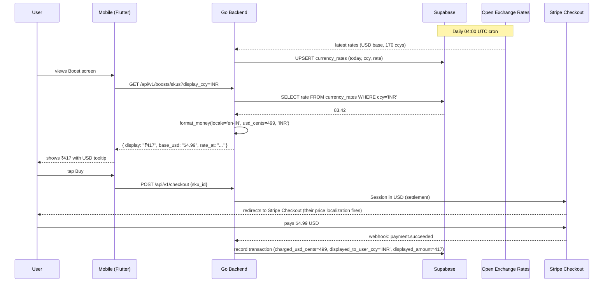

# Multi-Currency — App Flow

## 1. End-to-End Journey



## 2. State Machine — currency resolution

```
[boot]
  → [resolve preferred_currency]
       a. profile.preferred_currency           (manual override)
       b. region_default[profile.region]       (e.g. IN → INR)
       c. locale_default[profile.preferred_lang] (e.g. ja → JPY)
       d. USD                                   (final fallback)
[resolved] → [fetch rates from cache] → [format prices]
[fetch rates fails] → [serve last-good rates with stale flag]
[user changes ccy in settings] → [reload screens that show prices]
```

## 3. User Journeys

### J1 — First-time non-US user (happy path)
1. Riya, region=IN on signup.
2. Backend auto-sets `profile.preferred_currency=INR`.
3. Premium screen shows `₹417 / mo` with footnote "Equivalent to $4.99 USD".
4. She taps Buy; Stripe charges $4.99; her bank converts at its own rate.

### J2 — Manual override
1. Hiroshi (region=JP) prefers EUR display because he travels.
2. Settings → Language & Region → Currency → EUR.
3. All screens reload with EUR formatting.
4. `profile.preferred_currency=EUR` persisted; backend caches choice for 24h.

### J3 — FX stale
1. OXR API down 36h.
2. Backend uses last-good rates from `currency_rates` table; sets `stale_hours=36`.
3. UI footnote: "Exchange rate updated 2 days ago".
4. Sync worker retries every 30 min until fresh.

### J4 — Restricted currency (ARS, VES)
1. Argentine user sees Premium in ARS at *official* rate (which is ~half the street rate).
2. Footnote: "~" prefix and "Bank fees may apply; final price in USD".
3. Stripe charges USD; user's card issuer applies real rate.

### J5 — Refund
1. User bought Premium for $4.99 (displayed ~₹417 at time t).
2. Refund issued at t+10 days; FX changed; refund amount in USD = $4.99.
3. UI shows "Refunded $4.99 USD (~₹419 today; original was ₹417)".

## 4. Edge Cases

- **Zero-decimal currencies (JPY, KRW, IDR-no-cents):** display `¥740`, never `¥740.00`.
- **Three-decimal currencies (KWD, BHD, JOD):** display `KWD 1.234`.
- **Currency with no symbol:** show ISO code (`CHF 4.85`).
- **User changes currency mid-checkout:** lock display ccy at session start; show change in next session only.
- **Free items:** "Free" label, no formatting.
- **Negative amounts (refund):** `-₹417` with locale-aware sign placement.
- **Very large amounts (10M+):** `₹10,00,00,000` (Indian numbering) vs `$10,000,000` (Western).
- **Round-trip drift:** user-facing display rounded to 0 decimals for low-value JPY can introduce ±0.5%; we don't promise display equals charge.
- **Promotion ribbons:** strike-through old price uses same ccy.

## 5. Background / Async

- **Daily FX sync:** GitHub Action cron `0 4 * * *` UTC → calls OXR `/latest.json?app_id=...&base=USD`.
  - Idempotency key: `fx:sync:<date>`.
  - Failure policy: retry 3× with exponential backoff (5/15/45 min); on 3rd fail, send Sentry alert and use prior day's rates with `stale=true` flag.
  - Fallback to Frankfurter.app if OXR fails 5 days in a row.
- **Per-region currency mapping refresh:** static; baked into seed data; no async needed.

## 6. Notifications

- No notifications generated by this feature itself.
- Receipt emails (mail-gateway) include local + USD; rendered server-side.

## 7. Settings UI

```
[Settings] → [Language & Region]
  - Language          : Português (BR)
  - Region            : Brazil
  - Currency          : R$ Brazilian Real (BRL)   [change]
  - Timezone          : América/São_Paulo
  - Reset to defaults
```

Currency picker:
- Sorted by recent + suggested + alphabetical (within section)
- Search by ISO code, native name, English name
- Each row: `[symbol]  [native name]  [iso code]`

## 8. Failure Recovery

- If `currency_rates` empty (very early days): fall back to USD-only display, show banner "Local pricing coming soon".
- If user-selected currency was removed from supported list: revert to region default with one-time toast.
- If display-rounding crosses a psychological boundary (₹398.50 → ₹399 vs ₹398): always round-half-up, never down (small revenue benefit, transparent rule).
