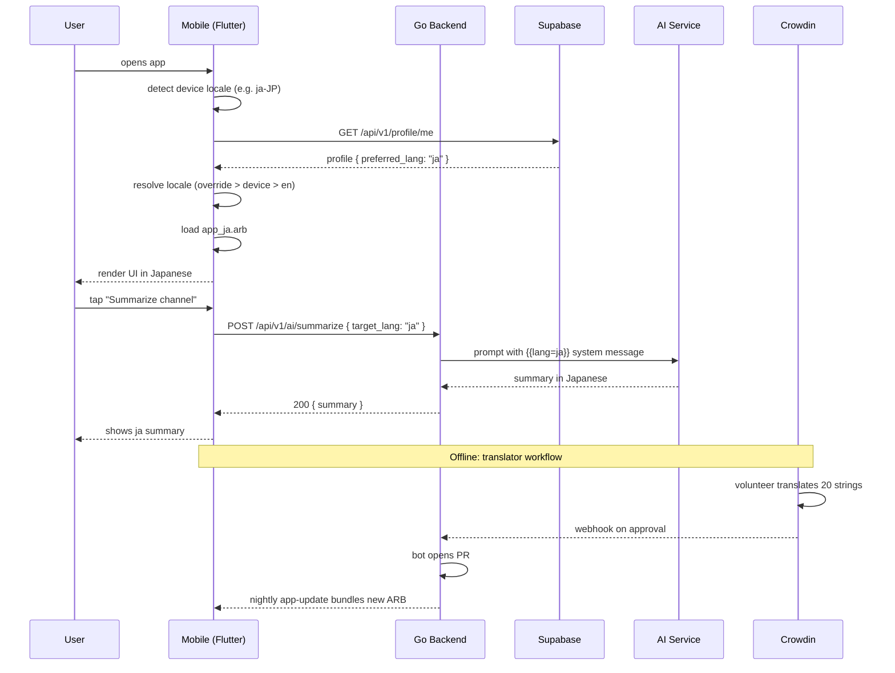

# Multi-Language 50+ — App Flow

## 1. End-to-End Journey



## 2. State Machine — locale resolution

```
[boot] --> [readDeviceLocale]
[readDeviceLocale] -- has profile.preferred_lang --> [useProfileLocale]
[readDeviceLocale] -- no profile, network ok --> [useDeviceLocale]
[readDeviceLocale] -- no profile, offline --> [useDeviceLocale]
[useProfileLocale] -- ARB missing --> [fallbackToEn]
[useDeviceLocale]  -- ARB missing --> [fallbackToEn]
[useProfileLocale] -- ARB loaded --> [ready]
[useDeviceLocale]  -- ARB loaded --> [ready]
[fallbackToEn] --> [ready]
[ready] -- user changes in settings --> [reloadLocale]
[reloadLocale] --> [ready]
```

## 3. User Journeys

### J1 — First-time non-English user (happy path)
1. Camila installs Flicko on her pt-BR Android device.
2. App boots, detects `pt_BR` from `Platform.localeName`.
3. `LocaleResolver` requests `app_pt.arb`; load succeeds.
4. Onboarding screens render in Portuguese, including AI Aura's welcome.
5. Camila signs up; backend stores `profiles.preferred_lang = 'pt'`.
6. All push notifications, emails (via mail-gateway templates), and AI replies are pt-BR.

### J2 — Manual override journey
1. Yuki has a Japanese phone but prefers English UI for technical terms.
2. Goes to `Settings > Language`.
3. Sees the picker grouped: "Suggested" (ja, en) → "All languages" (50 sorted by native name).
4. Picks "English"; confirmation dialog: "Restart UI in English?".
5. Tap confirm → `LocaleProvider` notifies; whole tree rebuilds; profile patched.

### J3 — Locale fallback (error path)
1. Server admin creates a custom welcome message in Klingon (tlh) — unsupported.
2. Member who is on `tlh` device locale opens Flicko.
3. ARB loader tries `app_tlh.arb` → 404.
4. Fallback chain: `tlh` → `en` (root). Logs Sentry breadcrumb `i18n.fallback`.
5. UI renders in English; a non-blocking banner says "Klingon is not yet supported. [Help translate]".

### J4 — Translator self-service
1. Yuki signs into Crowdin via GitHub OAuth.
2. Picks `Japanese (ja)`; sees 12,403 strings, 9,210 translated, 200 to review.
3. Filters "screenshots: settings_screen". Reviews 30 in 15 min, hits Approve.
4. CI runs nightly; downloads, opens PR `chore(l10n): sync 2026-05-29 ja:+185`.
5. Engineer merges; users get update via OTA bundle (no store re-release needed).

### J5 — AI-locale roundtrip
1. User on `ko` taps "Translate this thread" on a German message.
2. Mobile sends `{ source_text, target_lang: "ko" }` to AI service.
3. Service routes to Groq with system prompt `Reply in Korean. ...`.
4. Response cached `i18n_ai_cache:<hash>:ko`.
5. UI renders Korean translation in <1.5s.

## 4. Edge Cases

- **Offline at boot:** last cached profile.preferred_lang from `shared_preferences` wins; ARBs are bundled, so UI still renders localized.
- **ARB partially translated (e.g. 60%):** missing keys fall back to en at *string level*, not *file level*; user sees mixed UI rather than wholesale fallback.
- **Locale variant mismatch (`pt_BR` vs `pt_PT`):** prefer exact match; else `pt`; else `en`. Same for `zh_Hans` / `zh_Hant`.
- **Plurals with 0/1/few/many/other:** ICU `{count, plural, =0 {No items} one {1 item} other {# items}}` — covered for all 50 locales by Crowdin's plural-form metadata.
- **RTL bleed-in:** when user picks ar/he/fa/ur, hand off to `rtl-support` feature for `Directionality` flip.
- **ARB load race:** if user changes locale while a screen is loading, abort the in-flight `loadString` and start fresh with new locale code.
- **Backend error code missing translation:** server returns `{code: "ERR_NOT_FOUND", lang: "ja", message: "見つかりません"}`. If `ja` row is absent in `i18n_messages`, server falls back to `en` and includes `_fallback: true`.
- **Push notification at FCM:** we must localize *before* sending — push payload built per recipient using their stored `preferred_lang`.

## 5. Background / Async

- **Crowdin sync (nightly):**
  - Triggered by: GitHub Action cron `0 3 * * *` UTC.
  - Pulls all approved translations; runs `flutter gen-l10n`; opens PR if diff.
  - Idempotency key: `crowdin:sync:<commit-sha>`.
  - Failure policy: retry 3× with 30m backoff; on 3rd fail page on-call.
- **Screenshot upload (per release):**
  - Triggered by: tag push `v*`.
  - Runs Maestro `record_l10n.yaml` → uploads PNGs to Crowdin via CLI.
- **AI translation cache prewarm:**
  - For top-100 system prompts, precompute translations into all 50 locales weekly.
  - Stored in Redis `i18n:ai:warm:<key>:<lang>`.

## 6. Notifications

- **Push (FCM/APNs):** title and body localized server-side using `i18n_messages` lookup with the recipient's `preferred_lang`.
  - Trigger: any notification event (mention, reply, voice invite, AI digest).
  - Copy: see `i18n_messages` table — keys like `notif.mention.title`, `notif.mention.body`.
  - Deep link: `flicko://channel/<id>?lang=<recipient_lang>` (lang param so deep-linking previews in correct locale).
  - Batching: language-grouped digests (e.g. one ja digest, one fr digest) max 1 per 30 min per user.
- **Email (mail-gateway):** template selection by `recipient.preferred_lang`; templates stored under `mail-gateway/templates/<event>/<lang>.html`.
- **In-app banners:** rendered via existing `BannerProvider`; key from `app_<lang>.arb`.

## 7. Locale-Aware Rendering Rules

- Numbers: `NumberFormat.decimalPattern(locale).format(n)`.
- Dates: `DateFormat.yMMMd(locale).format(dt)` — but absolute time is rendered by `local-timezones` feature.
- Plurals: ICU MessageFormat in ARB.
- Genders: `{gender, select, male {彼} female {彼女} other {その人}}` — full coverage in pt, es, fr, de, ar, he, ru.
- Currency: never use `NumberFormat.currency` directly — always go through `format_money()` from `multi-currency`.

## 8. Settings UI Flow

```
[Profile] -> [Settings] -> [Language & Region]
   -> Language picker (50+, native names + flags)
   -> Region picker (drives currency/timezone defaults)
   -> "Help translate" link -> opens Crowdin
   -> "Pseudo-locale (dev)" -> only visible if isDebug
```
