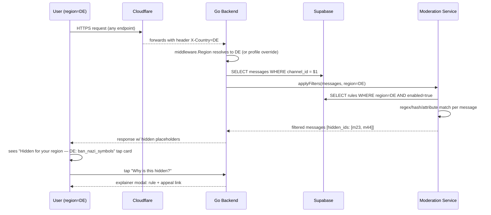

# Regional Content Filters — App Flow

## 1. End-to-End Journey



## 2. State Machine — content filter resolution

```
[message read]
  → [resolve viewer.region]      → from profile, fallback IP, fallback header
  → [load rules for region]      → cached LRU
  → [for each rule: match()?]
       → [regex content]   → match → hide
       → [hash media]      → match → hide
       → [channel/server attr] → match → hide
  → [if hidden] log audit + return placeholder
  → [if visible] return normal
```

## 3. User Journeys

### J1 — DE user reads a thread (happy path / hide)
1. Klaus opens #memes channel.
2. A US user posted a meme containing a banned symbol (DE rule `de.symbols.nazi`).
3. Backend filter sees DE region + matched rule.
4. Klaus's view shows: card "Hidden in Germany — banned symbol" with [Why?] [Appeal].
5. Audit log entry written.

### J2 — Admin creates content (write-side warning)
1. Mira posts a message containing a phrase on the DE banned list.
2. Pre-send classifier flags: "Heads up: this message will be hidden for users in Germany. [Edit] [Post anyway]".
3. She posts anyway; viewers in DE see hidden placeholder; viewers elsewhere see normal.

### J3 — KR under-19 user joins age-gated channel
1. Server has #mature channel marked `requires_age_attestation: 19+, region=KR`.
2. Min, 17, taps Join.
3. Modal: "This channel is restricted in your region. You must confirm you are 19+ to enter."
4. He picks "I am under 19" → toast "Channel hidden". Profile flag set.
5. Server admin sees member-list note "Min — age-restricted channels hidden".

### J4 — User overrides region (legitimate, e.g. expat)
1. Italian living in Germany sees their region auto-detected as DE.
2. Settings → Region → "Italy" → save.
3. Now sees content per IT rules (different from DE).
4. Audit logs override; if frequent (5+ in 30d) flagged for review.

### J5 — Sanctioned country user
1. Connection from Iran IP detected.
2. Backend returns 451 Unavailable For Legal Reasons; banner with policy link.
3. No data persisted, no service rendered.

### J6 — Rule update (admin)
1. Compliance officer pushes new rule via admin panel: "Add DE rule for new banned phrase".
2. Rule lands in `region_rules`, takes effect on next request (LRU TTL 60s).
3. Sentry annotation "rule deployed" + Slack ping to legal channel.

## 4. Edge Cases

- **Quote of forbidden content:** if a quoted message contains banned text, the quoting message is also hidden for DE viewers — to prevent boundary-bypass.
- **Translated content:** rules apply post-translation; we run filter on original AND translated text.
- **Image/audio:** hash-match against known-illegal hashes (PhotoDNA-style; we use perceptual hash). MVP covers a small bootstrap list (10 hashes) for DE banned imagery.
- **DM-to-DM (private):** filter still applies — viewer's region rules govern. Sender sees their message normal; recipient (DE) sees hidden.
- **Profile bio with banned text:** filtered from public view in affected regions; visible to user themselves.
- **Search results:** filtered before return.
- **Pinned messages:** still filtered.
- **Voice channel topics:** filtered.
- **Stage event titles:** filtered.
- **AI Aura responses:** Aura adds a check before delivery; if generated text matches a region rule for the *recipient*, regenerate with `avoid_topics` constraint.
- **Edits:** re-classify on every edit.
- **Conflicts (server policy stricter than region):** server policy wins for everyone in that server, regardless of viewer region.

## 5. Background / Async

- **Rule cache refresh:** every 60s LRU TTL; pg_notify on insert/update/delete forces immediate refresh.
- **Hash list updates:** weekly cron pulls from upstream content-safety partner (e.g. Thorn, INHOPE) — when we have the integration, currently manual.
- **Audit retention:** 365d hot, then archive to R2 monthly with anonymization.
- **VPN detection:** out of scope v1; tracked for future fraud signal.

## 6. Notifications

- Push notifications respect region rules: build payload, run through filter, drop if hidden for recipient.
- Mail-gateway: subject line filtered; if hidden, send fallback "You have a new message in Flicko" (no preview).
- Server admins receive a digest every Monday: "{n} messages hidden in your server this week (region {DE}: {n}, {KR}: {n})".

## 7. Settings UI Flow

```
[Settings] → [Language & Region]
  - Region: Germany (auto-detected)         [change]
  - "Why is content hidden for me?" → docs link
  - "Override region (advanced)"            [picker]
  - Age attestation: Confirmed 19+ ✓
```

## 8. Failure Recovery

- If `region_rules` query fails: default to **most strict known rule set** for safety (better to over-hide than under-hide). Sentry alert.
- If rule regex is bad (catastrophic backtracking): `regexp.MatchString` with timeout 50ms; on timeout, log and continue (don't hide).
- If region detection fails entirely: treat as `XX` (unknown) — apply *only* globally-mandatory rules (CSAM blocks etc.).

## 9. Transparency UX

- Every hidden item shows: an icon, a small badge with region code, a tap target.
- Tapping reveals: "This was hidden for your region (DE) under rule {de.symbols.nazi}. [Learn more] [Appeal]"
- Appeal opens a form mailing legal@flicko (subject prefilled with rule_id).
- We publish a quarterly transparency report with anonymized counts per region per rule.
