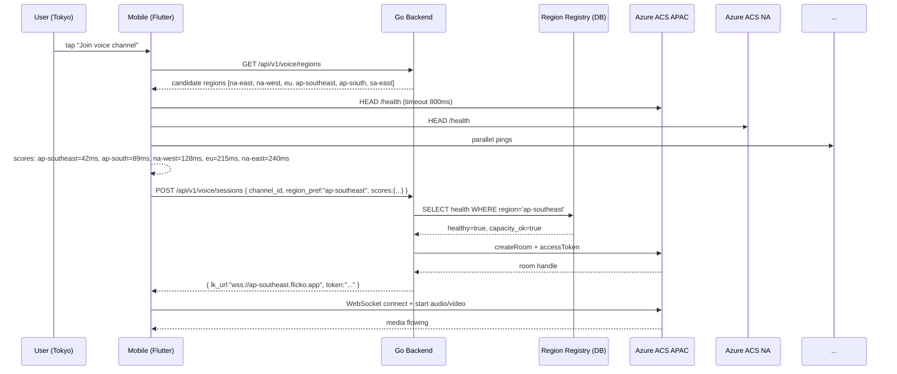

# Regional Voice Servers — App Flow

## 1. End-to-End Journey



## 2. State Machine — region selection

```
[user joins voice] → [client ping test, parallel, 800ms timeout]
       → [score = (rtt * 0.7) + (loss * 100 * 0.3)]
       → [server validates region health + capacity]
       → [if healthy] connect via that region
       → [if degraded] pick next best
[connected] → [periodic ping during call]
[ping > threshold for 30s] → [warn user] → [offer reconnect to next-best]
[participant joins from far region] → [server checks federation policy]
       → [if federation possible] keep both in their edges
       → [else] negotiate single region via aggregate min-RTT
```

## 3. User Journeys

### J1 — Tokyo user joins voice (happy path)
1. Yuki taps voice channel.
2. Client pings 6 edges in parallel; ap-southeast wins at 42ms.
3. Server confirms ap-southeast healthy + capacity OK.
4. Connection established in <500ms; audio quality excellent.

### J2 — Mid-call region degradation
1. Mid-conversation, ap-southeast experiences packet loss spike.
2. Client detects RTT >500ms or loss >5% sustained 30s.
3. Banner: "Voice quality dropped. Switch to next best (ap-south, 89ms)?" [Switch / Stay].
4. User taps Switch; client reconnects via ap-south; resumed in ~2s.
5. Audit log records failover.

### J3 — Cross-region call (federation)
1. Tokyo user (Yuki) and NY user (Alex) join the same channel.
2. Yuki connects to ap-southeast; Alex connects to na-east.
3. Azure ACS federation bridges the two rooms.
4. Yuki sees Alex's video with na-east → ap-southeast latency (~150ms cross-Pacific). Acceptable; the alternative (one of them on the wrong-side region) would be far worse for one of them.

### J4 — Manual override
1. User has unstable WiFi; auto-picks ap-south but wants to force ap-southeast.
2. Voice settings → Region → Pin to "ap-southeast".
3. Persisted; future calls use it; can be cleared.

### J5 — Server admin pin
1. Server admin running an event with mostly EU members pins server's voice to "eu-west".
2. APAC visitors get a banner "This server prefers eu-west voice" but can join via federation.
3. Useful for predictable latency in scheduled events.

### J6 — Region drained for maintenance
1. Ops drains eu-west for a 30-min update.
2. Registry marks `eu-west.draining=true`.
3. New sessions skip eu-west; existing sessions complete.
4. Banner to admins: "Pinned region unavailable, falling back to next-best for new joins".

## 4. Edge Cases

- **Captive portal / firewall blocks edge ports:** ping fails for all → fallback to TURN over 443 on whatever region passes; banner "Network restricted, voice may have higher latency".
- **VPN user:** ping reflects VPN exit, not actual location. Acceptable; user asked for that route.
- **Mobile network jitter:** smooth scores using EMA over 3 pings; don't switch on a single spike.
- **Region full (capacity):** server returns "redirect" to next-best with note.
- **Federation unavailable** (Azure ACS limit): pick the aggregate-best region for all participants in the room.
- **First joiner sets the room region** in v1 (simplest); other joiners federate or migrate room post-launch.
- **Zero pings succeeded:** fallback to default region (na-east) with degraded banner.
- **WebRTC ICE candidate failure:** retry with relay-only mode (TURN forced).
- **Behind double-NAT / symmetric NAT:** TURN relay used; latency a bit higher; no UX change.
- **Region whose endpoint passes ping but fails to negotiate:** mark unhealthy for 5 min on client side.

## 5. Background / Async

- **Health-check cron:** every 30s, central worker pings each region's `/health` from multiple datacenters; updates `voice_regions.last_health_check` and `health_score`.
- **Capacity sync:** each Azure ACS instance reports CPU/connections every 60s.
- **Session metrics:** every call posts an end-summary (region used, p50/p99 RTT, jitter, MoS) to `voice_session_metrics`.
- **Stale candidate prune:** if a region missed 3 health-checks, marked `degraded`; if 10, marked `down`.

## 6. Notifications

- **In-call banner** when voice quality drops.
- **Push** not used (voice is interactive).
- **Email**: monthly admin digest "Top regions used in your server: ap-southeast 42%, eu-west 31%, ..." for global admin tier.

## 7. Settings UI Flow

```
[Settings] → [Voice & Video]
  - Voice region: Auto (currently: ap-southeast)
                   [Pin region…]
  - Show region in call: ☑
  - Allow federation across regions: ☑

[Server settings] → [Voice]
  - Default region: Auto    [Pin "eu-west" for this server]
  - Allowed regions: [all checked]
```

## 8. Failure Recovery

- **All regions appear down to client:** show overlay "Voice service unavailable. We're investigating." with status link.
- **Token expired during call:** silent re-auth; if fails, user notified.
- **Reconnect during failover:** carry-over participant identity (preserve mute/deaf state).

## 9. Privacy / Data Residency

- KR users have an "EU/Korea-only" toggle (forthcoming) that restricts to data-residency-compliant regions.
- Connection metadata (region used, RTT) stored per session, retained 90d, anonymized for product analytics.
