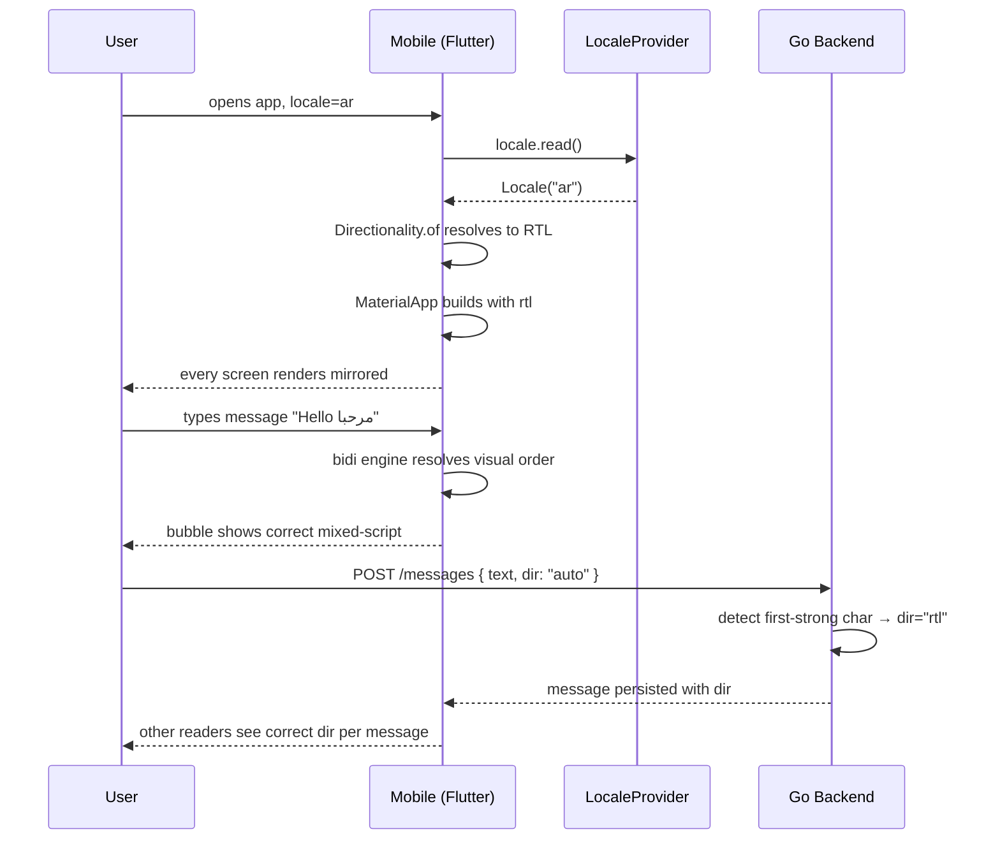

# RTL Support — App Flow

## 1. End-to-End Journey



## 2. State Machine — direction resolution per widget

```
[locale change] --> [Directionality rebuilds]
[message render] --> [autoDetectDir] --> [strong char ar/he/fa/ur?] --> [rtl]
                                      --> [strong char latin?]        --> [ltr]
                                      --> [no strong char]            --> [parent dir]
[icon] --> [is in directional allowlist?] --> yes: [mirror in rtl] / no: [keep]
[gesture] --> [swipe primary axis flipped in rtl]
```

## 3. User Journeys

### J1 — Arabic user opens app (happy path)
1. Mohammed sets device to ar-EG.
2. App detects, ARB and Directionality both flip on first build.
3. Bottom nav reads `الملف الشخصي → الإعدادات → الرئيسية` right to left.
4. Back arrow in app bar points right.
5. Drawer slides in from the right edge.
6. He sends a message; reply arrow points left (i.e. flipped).

### J2 — Mixed-language message (bidi correctness)
1. Sarah (he-IL) types: `Hello עולם, what's up?` in a chat.
2. Flutter renders with proper bidi: Hebrew word visually right-to-left within the LTR sentence; punctuation lands at the correct logical end.
3. Backend stores raw string; `direction = "rtl"` because first strong char is Latin → wait, in Hebrew sentences with English bracketed inside it can be ambiguous.
4. We persist `dir="auto"` and let the renderer decide; quote replies preserve the *original* direction.

### J3 — User overrides direction (rare power-user feature)
1. Power user pastes a code-heavy English snippet in a Hebrew DM.
2. Long-presses message composer → "Force direction: LTR".
3. Bubble renders LTR even though locale is RTL.
4. Setting persists per-channel for 24h.

### J4 — Edge: user on LTR locale reads RTL message
1. American user gets DMed an Arabic message.
2. Bubble renders RTL inside an LTR thread; alignment, mention pills behave per-message.
3. The *thread* is still LTR — only the bubble flips.

### J5 — Pseudo-RTL QA
1. Engineer toggles dev menu → "Pseudo-RTL".
2. App layout flips but text stays English.
3. Engineer notices the unread-badge is on the wrong side of an avatar.
4. Files PR; CI golden test would have caught it next time.

## 4. Edge Cases

- **Numbers in RTL text:** `"عمري 25 سنة"` — number stays LTR within RTL line. Default. If user enables Arabic-Indic digits, render `"٢٥"` instead.
- **Phone numbers / URLs:** force `Directionality.ltr` around them — they break visually otherwise (the dots in `192.168.1.1` and the slash in URLs misorder).
- **Code blocks:** always LTR. Wrap in explicit `Directionality(textDirection: TextDirection.ltr)`.
- **Emoji-only messages:** no strong char; inherit parent direction.
- **Strikethrough / mentions in RTL:** the `@user` pill should still keep `@` glyph attached to the username; we use `‎` (LRM) padding around mentions to prevent reorder.
- **Voice waveform:** time progresses left-to-right always (audio convention) — explicit LTR override.
- **Video timeline:** play arrow flips for chat reply but not for media controls — keep allowlist tight.
- **Markdown links** `[text](url)`: text follows message dir; URL forced LTR.
- **Slash commands** in RTL: `/ban @user` — slash always at logical start; in RTL, that visually appears on the right.
- **Date pickers:** flip month-arrow buttons; calendar grid stays Sunday-first or Monday-first per locale region.
- **Number sliders:** flip min/max ends in RTL.

## 5. Background / Async

- No background work specific to RTL. Only build-time golden tests in CI.
- One nightly job: `tools/rtl_audit.dart` walks the widget tree of all routes in pseudo-RTL and flags any RenderFlex overflow or `EdgeInsets.only(left:..)` that isn't directional.

## 6. Notifications

- Push title/body localized via `multi-language-50`; rendering is FCM/APNs side, both honor BCP-47 lang and Unicode bidi natively.
- Email (mail-gateway): every template gains `<html dir="{{.Dir}}">` based on recipient's `preferred_lang`.
- In-app banners use `Directionality.of(context)`; CTAs flip.

## 7. Per-Message Direction Detection

```
function detectDir(text):
    for ch in text:
        if isStrongLtr(ch): return ltr
        if isStrongRtl(ch): return rtl
    return parentDir
```

We use Unicode's first-strong heuristic. Fallback to parent direction if the message has no strong character (emoji, numbers only).

Backend stores: `messages.direction` ENUM('ltr','rtl','auto') with default `auto`. Server-side detection happens once on insert and is cached so clients don't re-detect.

## 8. Settings UI

```
[Settings] → [Language & Region]
   - Arabic digits ◯ off / ● on   (only shown for ar locale)
   - Force LTR in code blocks ● on (default)
   - Pseudo-RTL (dev only) ◯
```

## 9. Failure Recovery

- If `Directionality` cannot be resolved (corrupted locale): default to LTR + log Sentry breadcrumb.
- If a custom widget throws on RTL: wrap in safe area + LTR fallback at the widget level.
- If user reports a specific screen looks broken in RTL: Settings → "Report RTL bug" deep-links to GitHub with `route=<current-route>` prefilled.
