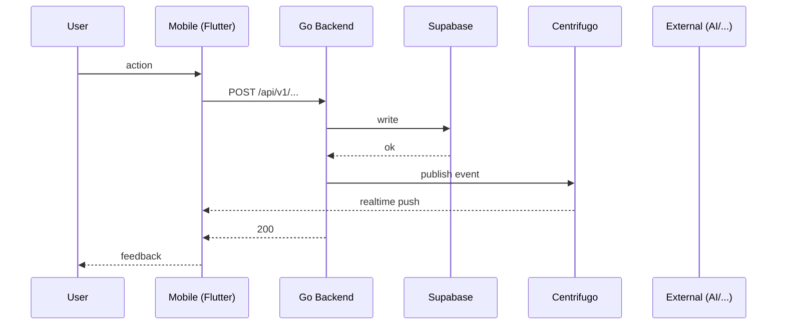

# [Feature Name] — App Flow

## 1. End-to-End Journey



## 2. State Machine

```
[idle] -- start --> [loading]
[loading] -- success --> [active]
[loading] -- error --> [error]
[error] -- retry --> [loading]
[active] -- cancel --> [idle]
```

## 3. User Journeys

### J1 — Happy path
1. User taps __
2. Sees __
3. Confirms __
4. Receives __

### J2 — Error path
1. ... fails because __
2. UI shows __
3. User retries / abandons

### J3 — First-time empty state
1. ...

## 4. Edge Cases

- Offline: queue + sync on reconnect
- Permission denied: hide / disable + tooltip
- Stale data: last-write-wins or CRDT
- Concurrent edits: __
- Rate limit hit: backoff + UI hint
- Network slow: optimistic UI + rollback on failure

## 5. Background / Async

- Triggered by: __
- Schedule: cron `*/__ * * * *`
- Idempotency key: `<feature>:<scope>:<bucket>`
- Failure policy: retry 3× with exponential backoff, then DLQ

## 6. Notifications

- Trigger event: __
- Channel: push / in-app / email / digest
- Copy: __
- Deep link: `flicko://<path>`
- Batching rule: max 1 per __ minutes
