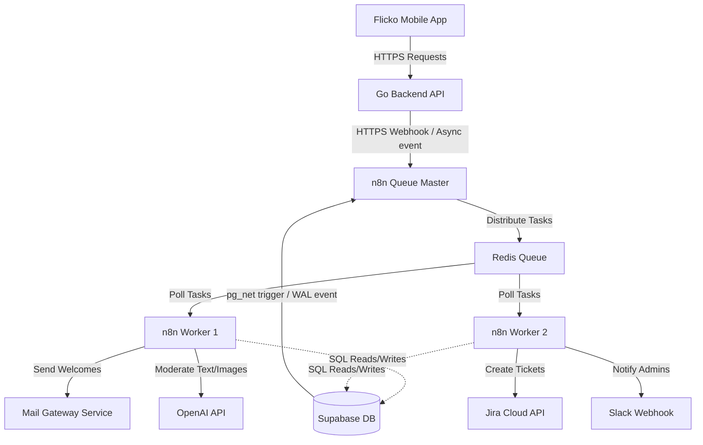
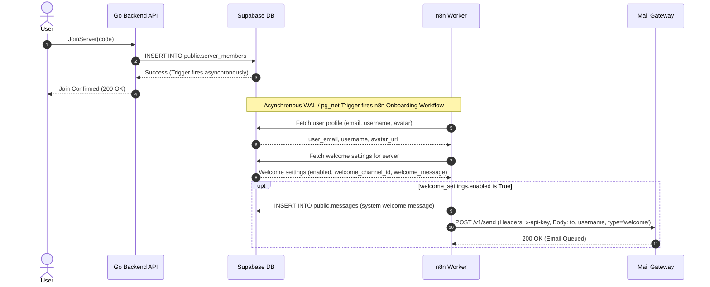

# Flicko & n8n Production Integration Guide

This document details the architectural layout, security constraints, and step-by-step blueprints required to integrate **n8n** as the primary asynchronous orchestrator for the **Flicko** ecosystem.

---

## 1. Executive Summary & Goals

n8n acts as the asynchronous workflow orchestrator for Flicko, offloading complex third-party integrations, scheduled cron events, and multi-step AI flows from the primary **Go Backend**.

### Key Objectives
* **Maintainability**: Replace hardcoded integration scripts in Go with visual, inspectable workflows.
* **Resilience**: Ensure database updates and external API calls are retryable, transactional, and insulated from client-facing latency.
* **Scalability**: Support thousands of concurrent executions per second using a stateless worker-pool model.

---

## 2. Production Scaling: Queue Mode Architecture

In a production environment, n8n must run in **Queue Mode** rather than a single-instance setup. This separates the editor interface from execution workers, enabling horizontal scalability.

### Core Components
1. **n8n Main (Editor/Orchestrator)**: Handles the user interface, workflow editing, and schedules. It writes to the n8n database and pushes tasks to Redis.
2. **n8n Workers**: Stateless runner instances that poll tasks from Redis, execute the workflow nodes, and write results back to the database.
3. **Redis**: Acts as the high-throughput message queue and broker (powered by BullJQ).
4. **PostgreSQL**: Stores workflow structures, execution history, metadata, and user accounts.

```
                  ┌────────────────────────┐
                  │   n8n Main (Editor)    │
                  └───────────┬────────────┘
                              │ Writes Workflows
                              ▼
┌──────────────┐   ┌────────────────────────┐   ┌──────────────┐
│  n8n Worker  │◄──┤      Redis Queue       ├──►│  n8n Worker  │
└──────┬───────┘   └────────────────────────┘   └──────┬───────┘
       │ Writes Logs                           Writes Logs│
       └──────────────┬────────────────────────┬──────────┘
                      ▼                        ▼
                  ┌────────────────────────┐
                  │  PostgreSQL (n8n DB)   │
                  └────────────────────────┘
```

### Production `docker-compose.yml` (Scalable Cluster)

```yaml
version: '3.8'

services:
  n8n-db:
    image: postgres:16-alpine
    environment:
      - POSTGRES_DB=n8n
      - POSTGRES_USER=n8n_master
      - POSTGRES_PASSWORD=secure_n8n_password
    volumes:
      - db_data:/var/lib/postgresql/data
    deploy:
      resources:
        limits:
          cpus: '1'
          memory: 2G

  redis:
    image: redis:7-alpine
    command: redis-server --appendonly yes
    volumes:
      - redis_data:/data

  n8n-main:
    image: docker.n8n.io/n8nio/n8n:latest
    command: /bin/sh -c "n8n"
    ports:
      - "5678:5678"
    environment:
      - N8N_HOST=n8n.flicko.app
      - N8N_PORT=5678
      - N8N_PROTOCOL=https
      - DB_TYPE=postgresdb
      - DB_POSTGRESDB_HOST=n8n-db
      - DB_POSTGRESDB_USER=n8n_master
      - DB_POSTGRESDB_PASSWORD=secure_n8n_password
      - DB_POSTGRESDB_DATABASE=n8n
      - EXECUTIONS_MODE=queue
      - QUEUE_BULL_REDIS_HOST=redis
    depends_on:
      - n8n-db
      - redis

  n8n-worker:
    image: docker.n8n.io/n8nio/n8n:latest
    command: /bin/sh -c "n8n worker"
    environment:
      - DB_TYPE=postgresdb
      - DB_POSTGRESDB_HOST=n8n-db
      - DB_POSTGRESDB_USER=n8n_master
      - DB_POSTGRESDB_PASSWORD=secure_n8n_password
      - DB_POSTGRESDB_DATABASE=n8n
      - EXECUTIONS_MODE=queue
      - QUEUE_BULL_REDIS_HOST=redis
    depends_on:
      - n8n-db
      - redis
    deploy:
      mode: replicated
      replicas: 3 # Scale dynamically based on load

volumes:
  db_data:
  redis_data:
```

---

## 3. System Architecture Diagram

This diagram shows how n8n interacts with the Go Backend, Supabase, and external services:



---

## 4. Security & Database Isolation Policies

Exposing write permissions on your main transactional database to an orchestration platform introduces risks. Apply the following rules:

### A. Principle of Least Privilege (Supabase Integration)
Do **not** use the default database superuser `postgres` for n8n. Create a restricted SQL role:

```sql
-- Create role
CREATE ROLE n8n_integration WITH LOGIN PASSWORD 'secure_integration_password';

-- Grant narrow schema access
GRANT USAGE ON SCHEMA public TO n8n_integration;

-- Grant limited table permissions for onboarding, messaging, and reporting
GRANT SELECT, UPDATE ON public.profiles TO n8n_integration;
GRANT SELECT, INSERT, UPDATE ON public.messages TO n8n_integration;
GRANT SELECT, INSERT ON public.reports TO n8n_integration;
GRANT SELECT, INSERT, UPDATE ON public.mod_signals TO n8n_integration;
GRANT SELECT, INSERT, UPDATE ON public.mod_queue_items TO n8n_integration;

-- Explicitly revoke access to tables containing authentication sessions, bot keys, or push tokens
REVOKE ALL ON public.bots FROM n8n_integration;
REVOKE ALL ON public.sessions FROM n8n_integration;
REVOKE ALL ON public.push_notification_tokens FROM n8n_integration;
```

### B. Whitelisting & VPN
1. **IP Constraints**: In Supabase (or whichever cloud database is used), restrict access to the database port (`5432`) to the elastic public IPs of the n8n worker nodes.
2. **Internal Networking**: If running on the same Kubernetes cluster or VPS network, route database connections over private VPC interfaces (`10.x.x.x`) instead of public endpoints.

### C. Webhook Signature Verification
To prevent malicious third parties from invoking your public n8n webhook nodes:
1. Generate an HMAC-SHA256 signature key in your Go Backend.
2. When calling an n8n webhook, attach the signature in the headers:
   `X-Flicko-Signature: t=timestamp,v1=signature_hash`
3. Add a **Code Node** in n8n as the very first step of the workflow to verify the signature before processing the payload.

#### n8n Signature Verification Code Node (JavaScript)
```javascript
const crypto = require('crypto');

// Retrieve headers and body from the incoming webhook request
const headers = $input.item.json.headers;
const body = $input.item.json.body;

const signatureHeader = headers['x-flicko-signature'] || headers['X-Flicko-Signature'];
if (!signatureHeader) {
  throw new Error('Missing X-Flicko-Signature header');
}

// Parse signature: t=timestamp,v1=hash
const parts = signatureHeader.split(',');
const timestampPart = parts.find(p => p.startsWith('t='));
const hashPart = parts.find(p => p.startsWith('v1='));

if (!timestampPart || !hashPart) {
  throw new Error('Invalid signature format');
}

const timestamp = timestampPart.split('=')[1];
const signatureHash = hashPart.split('=')[1];

// Prevent replay attacks (refuse requests older than 5 minutes)
const now = Math.floor(Date.now() / 1000);
if (Math.abs(now - parseInt(timestamp, 10)) > 300) {
  throw new Error('Signature expired (replay protection)');
}

// Recompute HMAC-SHA256 hash using the shared secret
const secret = process.env.WEBHOOK_SECRET_KEY;
const stringToSign = `${timestamp}.${JSON.stringify(body)}`;
const computedHash = crypto
  .createHmac('sha256', secret)
  .update(stringToSign)
  .digest('hex');

if (computedHash !== signatureHash) {
  throw new Error('Invalid signature hash');
}

// Return the validated body for subsequent nodes to consume
return [{ json: body }];
```

---

## 5. Database Triggering Methods

To trigger n8n workflows based on database events (such as a new message posted, or a new profile report created), choose one of the following production-ready methods:

### Method A: PostgreSQL Logical Replication (n8n Postgres Trigger Node)
n8n includes a built-in **PostgreSQL Trigger** node that acts as a WAL (Write-Ahead Log) replication listener.
1. **Database Config**: Ensure your PostgreSQL instance has logical replication enabled:
   ```sql
   ALTER SYSTEM SET wal_level = logical;
   -- Restart PostgreSQL to apply changes
   ```
2. **Setup**:
   - Create a replication slot and publication on Supabase/Postgres:
     ```sql
     CREATE PUBLICATION n8n_publication FOR ALL TABLES;
     ```
   - In n8n, add a **PostgreSQL Trigger** node, configure the connection to use the `n8n_integration` role, specify the target table (e.g., `messages` or `reports`), and choose the events (`INSERT`, `UPDATE`).
3. **Pros**: Zero database code or triggers, high-throughput, real-time trigger with zero latency overhead on transactional queries.
4. **Cons**: Requires database superuser access to set up publications/replication slots.

### Method B: Asynchronous HTTP Webhooks via `pg_net`
If logical replication/WAL access is restricted, use Supabase's native `pg_net` extension to make asynchronous HTTP POST requests directly to n8n webhook nodes from standard Postgres triggers.
1. **Enable pg_net**:
   ```sql
   CREATE EXTENSION IF NOT EXISTS pg_net WITH SCHEMA extensions;
   ```
2. **Create Trigger Function**:
   ```sql
   CREATE OR REPLACE FUNCTION public.notify_n8n_on_message()
   RETURNS TRIGGER AS $$
   DECLARE
     payload_json TEXT;
     secret_key TEXT := 'your_webhook_secret_key';
     timestamp TEXT;
     signature TEXT;
   BEGIN
     -- Construct webhook payload
     payload_json := jsonb_build_object(
       'id', NEW.id,
       'channel_id', NEW.channel_id,
       'author_id', NEW.author_id,
       'content', NEW.content,
       'created_at', NEW.created_at
     )::text;
     
     timestamp := extract(epoch from now())::text;
     -- Compute signature using hmac to prevent spoofing
     signature := encode(hmac(timestamp || '.' || payload_json, secret_key, 'sha256'), 'hex');

     -- Perform asynchronous HTTP POST request
     PERFORM net.http_post(
       url := 'https://n8n.flicko.app/webhook/moderation',
       headers := jsonb_build_object(
         'Content-Type', 'application/json',
         'X-Flicko-Signature', 't=' || timestamp || ',v1=' || signature
       ),
       body := payload_json
     );
     RETURN NEW;
   END;
   $$ LANGUAGE plpgsql SECURITY DEFINER;
   ```
3. **Bind Trigger**:
   ```sql
   CREATE TRIGGER tr_message_insert_n8n
   AFTER INSERT ON public.messages
   FOR EACH ROW
   EXECUTE FUNCTION public.notify_n8n_on_message();
   ```
4. **Pros**: Highly customizable payloads, standard HTTP webhooks, easily deployed on standard Postgres hosting.
5. **Cons**: Slight database run overhead per statement, requires `pg_net` extension.

---

## 6. Integration Workflow Specifications

### A. Onboarding Flow (Sequence Diagram)
Triggered when a member joins a server. Resolves the user profile, verifies welcome settings, posts a system welcome message, and routes the welcome email to the mail-gateway.



#### Onboarding Workflow Execution Steps
1. **Trigger Node**: Listen to `INSERT` events on `public.server_members` using a WAL listener or a `pg_net` trigger.
2. **Supabase Read Profile**: Read profile information (`email`, `username`, `avatar_url`) from the `public.profiles` table matching the newly joined user's ID.
3. **Supabase Read Settings**: Read welcome configuration (`enabled`, `welcome_channel_id`, `welcome_message`) from the `public.welcome_settings` table for the corresponding `server_id`.
4. **Conditional Node**: If `welcome_settings.enabled` is false, terminate execution.
5. **Format Message Code Node**: Interpolate the welcome message template:
   - Replace `{{user}}` with the user's username.
   - Replace `{{server}}` with the server name.
6. **Supabase Insert Message**: Insert a row into `public.messages` with `author_id = NULL` (indicating a system message), the formatted content, and the targeted `channel_id`.
7. **Mail Gateway POST**: Perform an HTTP POST to the internal `mail-gateway` endpoint `/v1/send`:
   - **Headers**:
     - `Content-Type: application/json`
     - `x-api-key: <SEND_API_KEY>` (securely retrieved from n8n environment variables)
   - **Payload**:
     ```json
     {
       "to": "user_email@example.com",
       "username": "user_display_name",
       "type": "welcome",
       "avatar_url": "user_avatar_url"
     }
     ```

---

### B. AI-Powered Content Moderation
Runs automatically when a user posts a message. Audits the content via OpenAI, flags violations, sanitizes the message, and updates the database moderation tables.

#### Workflow Setup
1. **Trigger**: Listen to `INSERT` events on `public.messages` (either via logical replication WAL trigger or a `pg_net` database trigger).
2. **n8n Action (AI Evaluation)**:
   - Send the message content to an **OpenAI Chat Node** with the prompt:
     > *"You are a strict content moderator for Flicko. Analyze the following text for hate speech, harassment, self-harm, sexual content, or extreme violence. Respond with a JSON object: `{ "safe": true|false, "scores": { "hate": 0.0, "harassment": 0.0, "sexual": 0.0, "self_harm": 0.0, "violence": 0.0 }, "reason": "why" }`."*
3. **n8n Conditional Routing**:
   - **If Safe**: Do nothing.
   - **If Unsafe**:
     - **Sanitize Message**: Run SQL to redact the message in the database:
       ```sql
       UPDATE public.messages 
       SET content = '[Blocked due to content violations]' 
       WHERE id = $1;
       ```
     - **Persist Mod Signal**: Record the decision in the `public.mod_signals` table (aligns with Flicko's Llama-Guard logging):
       ```sql
       INSERT INTO public.mod_signals 
         (id, message_id, user_id, server_id, channel_id, text_hash, 
          scores, decision, classifier, classifier_v)
       VALUES 
         ($1, $2, $3, $4, $5, $6, $7::jsonb, 'blocked', 'n8n:openai', 'v1');
       ```
     - **Enqueue Review (Optional)**: If configured, add the message to the human moderation queue for potential appeals:
       ```sql
       INSERT INTO public.mod_queue_items (id, signal_id, server_id, text_plain)
       VALUES ($1, $2, $3, $4);
       ```
     - **Notify Admin**: Send a webhook notification to Slack/Discord with the message metadata (excluding the redacted plain text or attaching it with sensitive warning).

---

### C. Support Ticketing (Profile Reporting)
Triggered when a user reports a profile. Validates description length, inserts reports into the database, and creates a corresponding Jira support ticket.

#### Payload Structure (Triggered from `public.reports` Table INSERT)
The workflow is triggered when a new row is added to the `public.reports` table (where `target_type = 'user'`).
```json
{
  "id": "c1a2ab50-0d7a-40f6-b0cb-a7a2ab505c12",
  "server_id": "5f9e9bf7-3e88-490b-9f20-f6862eac005b",
  "reporter_id": "92e1f32e-0d7a-40f6-b0cb-a7a2ab505a6b",
  "report_type": "harassment",
  "target_type": "user",
  "target_id": "18ac23c0-0d7a-40f6-b0cb-a7a2ab505c12",
  "description": "User is spamming toxic messages in general chat",
  "status": "pending",
  "created_at": "2026-06-24T16:00:00Z"
}
```

#### Workflow Steps
1. **Trigger**: Listen to `INSERT` on `public.reports` table.
2. **Validate Input Node**: A Code node checks that `description` is at least 10 characters (enforcing DB constraint sanity check).
3. **Supabase Read Profiles**:
   - Queries `public.profiles` where `id = reporter_id` to get `reporter_username`.
   - Queries `public.profiles` where `id = target_id` to get `reported_username`.
4. **Jira Node (or Trello)**: Creates a support card:
   - **Project**: Support Queue
   - **Title**: `[Profile Report] User @reported_username`
   - **Description**:
     > **Report ID**: `{{$json.id}}`
     > **Reporter**: `@reporter_username` (`{{$json.reporter_id}}`)
     > **Reported User**: `@reported_username` (`{{$json.target_id}}`)
     > **Category**: `{{$json.report_type}}`
     > **Description**: `{{$json.description}}`
   - **Priority**: Scored based on category (e.g., `harassment` mapped to High, `other` to Medium).
5. **Slack Node**: Pings `#support-alerts` with:
   > 🚨 **New Profile Report**: `@reporter_username` reported `@reported_username` for **harassment**. Jira ticket created: `<jira-ticket-url>`

---

## 7. Monitoring, Metrics, & Disaster Recovery

### A. Health Checks & Monitoring
* **Liveness Probe**: Set up Prometheus/Grafana or a standard uptime monitor pointing to the n8n endpoint `GET /healthz`.
* **Execution Status Endpoint**: Configure Prometheus alerting rules to warn if n8n queues reach more than 500 unprocessed jobs or if worker CPU exceeds 85%.

### B. Version Control (Infrastructure as Code)
* Keep your workflows checked into your GitHub repository.
* Run a cron pipeline inside n8n to export all active workflow schemas automatically:
  ```bash
  n8n export:workflow --all --output=/app/workflows/all_workflows.json
  ```
* Commit and push this JSON file to a private `flicko-n8n-workflows` repository daily. This ensures you can rebuild the entire system in seconds in the event of database loss.

---

## 8. Phased Implementation Plan

```
Phase 1: Local Setup & Testing   Phase 2: Security & Routing   Phase 3: Production Deploy
        (Week 1)                       (Week 2)                    (Week 3)
┌─────────────────────────────┐┌──────────────────────────┐┌────────────────────────┐
│  - Spin up n8n on Docker    ││ - Setup postgres role    ││ - Deploy Queue Mode    │
│  - Connect local Postgres   ││ - Signature verify code  ││ - Set whitelists/VPN   │
│  - Build Onboarding mockup  ││ - Wire pg_net Triggers   ││ - Wire real APIs      │
└─────────────────────────────┘└──────────────────────────┘└────────────────────────┘
```
