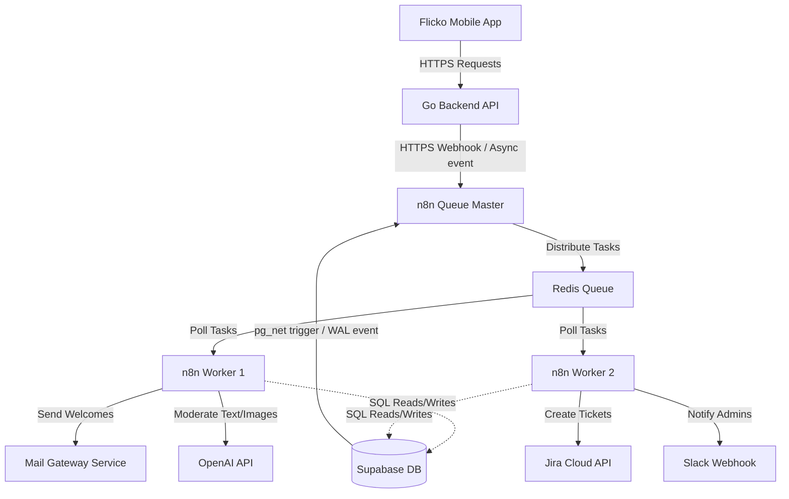

# Flicko & n8n Production Integration Guide

This document details the architectural layout, security constraints, and step-by-step blueprints required to integrate **n8n** as the primary asynchronous orchestrator for the **Flicko** ecosystem.

---

## 1. Executive Summary & Goals

n8n acts as the asynchronous workflow orchestrator for Flicko, offloading complex third-party integrations, scheduled cron events, and multi-step AI flows from the primary **Go Backend**.

### Key Objectives
* **Maintainability**: Replace hardcoded integration scripts in Go with visual, inspectable workflows.
* **Resilience**: Ensure database updates and external API calls are retryable, transactional, and insulated from client-facing latency.
* **Scalability**: Support thousands of concurrent executions per second using a stateless worker-pool model.

---

## 2. Production Scaling: Queue Mode Architecture

In a production environment, n8n must run in **Queue Mode** rather than a single-instance setup. This separates the editor interface from execution workers, enabling horizontal scalability.

### Core Components
1. **n8n Main (Editor/Orchestrator)**: Handles the user interface, workflow editing, and schedules. It writes to the n8n database and pushes tasks to Redis.
2. **n8n Workers**: Stateless runner instances that poll tasks from Redis, execute the workflow nodes, and write results back to the database.
3. **Redis**: Acts as the high-throughput message queue and broker (powered by BullJQ).
4. **PostgreSQL**: Stores workflow structures, execution history, metadata, and user accounts.

```
                  ┌────────────────────────┐
                  │   n8n Main (Editor)    │
                  └───────────┬────────────┘
                              │ Writes Workflows
                              ▼
┌──────────────┐   ┌────────────────────────┐   ┌──────────────┐
│  n8n Worker  │◄──┤      Redis Queue       ├──►│  n8n Worker  │
└──────┬───────┘   └────────────────────────┘   └──────┬───────┘
       │ Writes Logs                           Writes Logs│
       └──────────────┬────────────────────────┬──────────┘
                      ▼                        ▼
                  ┌────────────────────────┐
                  │  PostgreSQL (n8n DB)   │
                  └────────────────────────┘
```

### Production `docker-compose.yml` (Scalable Cluster)

```yaml
version: '3.8'

services:
  n8n-db:
    image: postgres:16-alpine
    environment:
      - POSTGRES_DB=n8n
      - POSTGRES_USER=n8n_master
      - POSTGRES_PASSWORD=secure_n8n_password
    volumes:
      - db_data:/var/lib/postgresql/data
    deploy:
      resources:
        limits:
          cpus: '1'
          memory: 2G

  redis:
    image: redis:7-alpine
    command: redis-server --appendonly yes
    volumes:
      - redis_data:/data

  n8n-main:
    image: docker.n8n.io/n8nio/n8n:latest
    command: /bin/sh -c "n8n"
    ports:
      - "5678:5678"
    environment:
      - N8N_HOST=n8n.flicko.app
      - N8N_PORT=5678
      - N8N_PROTOCOL=https
      - DB_TYPE=postgresdb
      - DB_POSTGRESDB_HOST=n8n-db
      - DB_POSTGRESDB_USER=n8n_master
      - DB_POSTGRESDB_PASSWORD=secure_n8n_password
      - DB_POSTGRESDB_DATABASE=n8n
      - EXECUTIONS_MODE=queue
      - QUEUE_BULL_REDIS_HOST=redis
    depends_on:
      - n8n-db
      - redis

  n8n-worker:
    image: docker.n8n.io/n8nio/n8n:latest
    command: /bin/sh -c "n8n worker"
    environment:
      - DB_TYPE=postgresdb
      - DB_POSTGRESDB_HOST=n8n-db
      - DB_POSTGRESDB_USER=n8n_master
      - DB_POSTGRESDB_PASSWORD=secure_n8n_password
      - DB_POSTGRESDB_DATABASE=n8n
      - EXECUTIONS_MODE=queue
      - QUEUE_BULL_REDIS_HOST=redis
    depends_on:
      - n8n-db
      - redis
    deploy:
      mode: replicated
      replicas: 3 # Scale dynamically based on load

volumes:
  db_data:
  redis_data:
```

---

## 3. System Architecture Diagram

This diagram shows how n8n interacts with the Go Backend, Supabase, and external services:



---

## 4. Security & Database Isolation Policies

Exposing write permissions on your main transactional database to an orchestration platform introduces risks. Apply the following rules:

### A. Principle of Least Privilege (Supabase Integration)
Do **not** use the default database superuser `postgres` for n8n. Create a restricted SQL role:

```sql
-- Create role
CREATE ROLE n8n_integration WITH LOGIN PASSWORD 'secure_integration_password';

-- Grant narrow schema access
GRANT USAGE ON SCHEMA public TO n8n_integration;

-- Grant limited table permissions
GRANT SELECT, UPDATE ON public.profiles TO n8n_integration;
GRANT SELECT, INSERT ON public.messages TO n8n_integration;
GRANT SELECT, INSERT ON public.reports TO n8n_integration;

-- Exclude tables containing critical keys or salts
REVOKE ALL ON public.ratchet_wal_store FROM n8n_integration;
```

### B. Whitelisting & VPN
1. **IP Constraints**: In Supabase (or whichever cloud database is used), restrict access to the database port (`5432`) to the elastic public IPs of the n8n worker nodes.
2. **Internal Networking**: If running on the same Kubernetes cluster or VPS network, route database connections over private VPC interfaces (`10.x.x.x`) instead of public endpoints.

### C. Webhook Signature Verification
To prevent malicious third parties from invoking your public n8n webhook nodes:
1. Generate an HMAC-SHA256 signature key in your Go Backend.
2. When calling an n8n webhook, attach the signature in the headers:
   `X-Flicko-Signature: t=timestamp,v1=signature_hash`
3. Add a **Code Node** in n8n as the very first step of the workflow to verify the signature before processing the payload.

---

## 5. Integration Workflow Specifications

### A. Onboarding Flow (Sequence Diagram)
Triggered when a member joins a server. Automatically provisions welcome channels, assigns roles, and queues notifications.

```mermaid
sequenceDiagram
    autonumber
    actor User
    participant GoAPI as Go Backend API
    participant DB as Supabase DB
    participant n8n as n8n Webhook
    participant Mail as Mail Gateway

    User->>GoAPI: JoinServer(code)
    GoAPI->>DB: INSERT INTO server_members
    DB-->>GoAPI: Success
    GoAPI->>n8n: HTTP POST /onboarding (user_id, server_id, email)
    Note over GoAPI,n8n: Sent asynchronously; Go API returns 200 OK immediately
    GoAPI-->>User: Join Confirmed
    
    n8n->>DB: Check welcome_settings row
    DB-->>n8n: Enabled, Message template, Welcome Channel ID
    
    opt Welcome Channel ID is Null
        n8n->>DB: Create default welcome channel
        DB-->>n8n: Channel ID
        n8n->>DB: Update welcome_settings (save welcome channel ID)
    end

    n8n->>DB: Insert welcoming system message
    n8n->>Mail: POST /v1/send-welcome (email)
```

---

### B. AI-Powered Content Moderation
Runs automatically when a user posts an image or message.

#### Workflow Setup
1. **Trigger**: Database trigger on `public.messages` (INSERT) calls the n8n webhook.
2. **n8n Action (AI Evaluation)**:
   * Passes the message content to an **OpenAI Chat Node** with the system prompt:
     > *"You are a strict content moderator for Flicko. Analyze the following text for hate speech, harassment, self-harm, or extreme violence. Respond with a JSON object: `{ "safe": true|false, "reason": "why" }`."*
3. **n8n Conditional Routing**:
   * **If Safe**: Do nothing.
   * **If Unsafe**:
     * Execute SQL: `UPDATE public.messages SET content = '[Blocked due to content violations]', flagged = true WHERE id = $1`.
     * Notify Admin: Send Slack message with the original content and the author's ID.

---

### C. Support Ticketing (Profile Reporting)
Triggered when the "Report Profile" option is clicked inside the profile 3-dots sheet.

#### Payload Structure
```json
{
  "reporter_id": "92e1f32e-0d7a-40f6-b0cb-a7a2ab505a6b",
  "reported_id": "18ac23c0-0d7a-40f6-b0cb-a7a2ab505c12",
  "reason": "Harassment",
  "details": "User is spamming toxic messages in general chat"
}
```

#### Workflow Steps
1. **Webhook Node**: Receives the JSON payload from the Go API.
2. **Supabase Node**: Reads profile information for both the reporter and the reported user to retrieve their usernames.
3. **Jira Node (or Trello)**: Creates a new ticket:
   * **Title**: `[Profile Report] User @reported_username`
   * **Description**: `Reported by @reporter_username. Reason: Harassment. Details: ...`
4. **Slack Node**: Pings `#support-alerts` with a link to the Jira card.

---

## 6. Monitoring, Metrics, & Disaster Recovery

### A. Health Checks & Monitoring
* **Liveness Probe**: Set up Prometheus/Grafana or a standard uptime monitor pointing to the n8n endpoint `GET /healthz`.
* **Execution Status Endpoint**: Configure Prometheus alerting rules to warn if n8n queues reach more than 500 unprocessed jobs or if worker CPU exceeds 85%.

### B. Version Control (Infrastructure as Code)
* Keep your workflows checked into your GitHub repository.
* Run a cron pipeline inside n8n to export all active workflow schemas automatically:
  ```bash
  n8n export:workflow --all --output=/app/workflows/all_workflows.json
  ```
* Commit and push this JSON file to a private `flicko-n8n-workflows` repository daily. This ensures you can rebuild the entire system in seconds in the event of database loss.

---

## 7. Phased Implementation Plan

```
Phase 1: Local Setup & Testing   Phase 2: Security & Routing   Phase 3: Production Deploy
        (Week 1)                       (Week 2)                    (Week 3)
┌─────────────────────────────┐┌──────────────────────────┐┌────────────────────────┐
│  - Spin up n8n on Docker    ││ - Setup postgres role    ││ - Deploy Queue Mode    │
│  - Connect local Postgres   ││ - Signature verify code  ││ - Set whitelists/VPN   │
│  - Build Onboarding mockup  ││ - Wire Go Webhooks      ││ - Wire real APIs      │
└─────────────────────────────┘└──────────────────────────┘└────────────────────────┘
```
