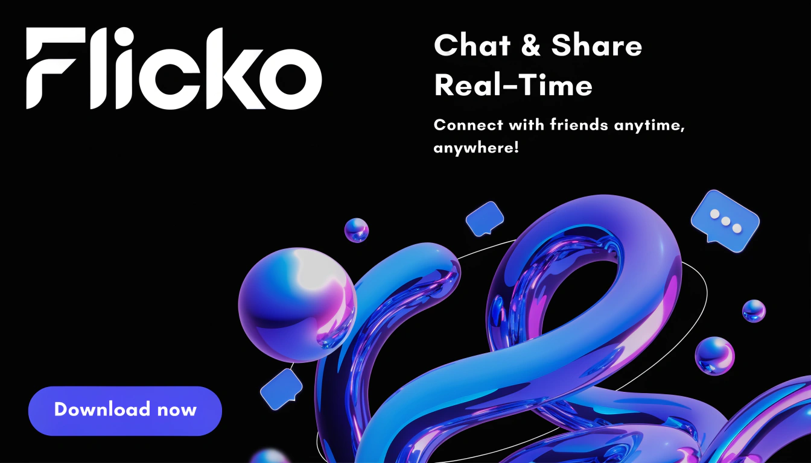

# Flicko

A media-first marketing site showcasing Flicko — product highlights, brand resources, and Nitro. Designed to tell the product story with motion, video, and rich media while keeping content focused on conversion and clarity.

Why Flicko
- Cinematic hero sections with motion and embedded video
- Dedicated brand and media pages for assets and guidelines
- Developer-facing page for quick integrations and docs
- Responsive, accessibility-minded layouts tuned for marketing funnels

Highlights
- Engaging, media-first landing experience
- Brand & asset hub under `/branding`
- Company, legal, and developer pages for trust and integration
- Nitro — premium offering showcased with clear upsell messaging

Primary pages
- `/` — Home / hero experience
- `/branding` — Brand assets & guidelines
- `/company` — Company information & press
- `/developers` — Developer resources and API notes
- `/nitro` — Premium features & benefits
- `/privacy` — Privacy policy
- `/terms` — Terms of service

Live demo
- Add your production URL here to link directly to the live site.

Assets
- All public images, fonts, and videos live in the `public/` directory (e.g. `public/flicko_banner.png`, `public/fonts`, `public/Videos`).

Contact
- For demos, partnerships, or press inquiries: hello@flicko.com

Brand & credits
- Designed as a motion- and video-first marketing experience. Add trademark and credit details here if needed.

License
- No license file included. Add a `LICENSE` if you want to grant reuse permissions.
# Flicko-Markiting
